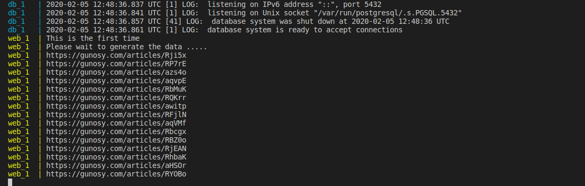
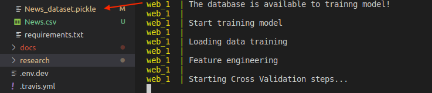
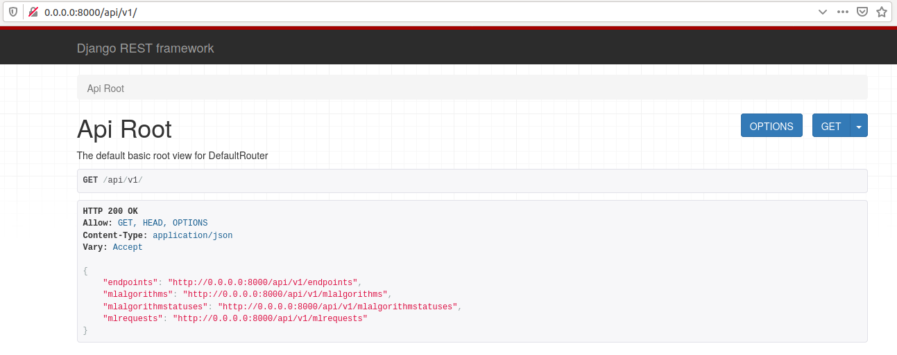
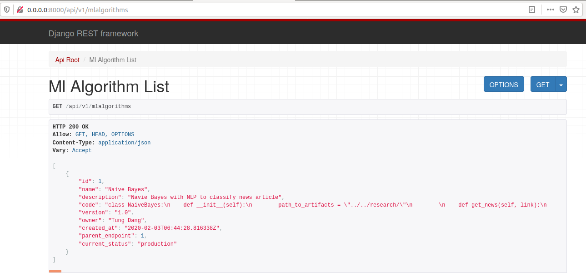
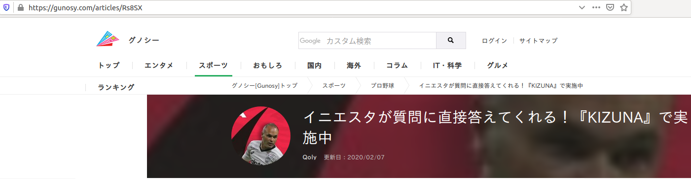
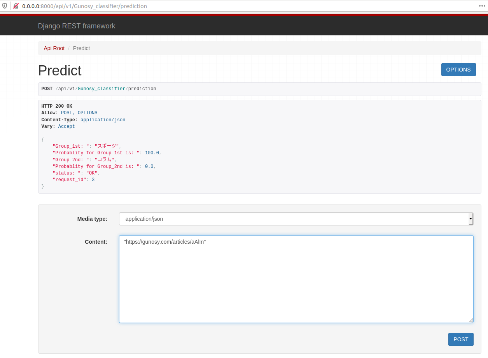

[](https://travis-ci.com/tungtokyo1108/Gunosy-Data_Analysis)

# Gunosy data analysis project: News classification 

## Pre-requisites:

* `docker` and `docker-compose`: The [Docker](https://docs.docker.com/install/) and [Docker-compose](https://docs.docker.com/compose/install/) command-line interface. Follow these installation instructions for your system.
* The recommended resources for this model is 32GB RAM + 8 CPUs (Ubuntu 18.04.4 LTS or macOS Mojave version 10.14.6). 

## Research 

- Including the data collection, data pre-processing, feature engineering, model training, model evaluation. In order to read the specific methods, please go to [here](https://github.com/tungtokyo1108/Gunosy-Data_Analysis/blob/master/research/README.md) 
- To overcome for Gunosy's second requirement for the improvement of document classification performance, I try to collect data several times on some days in order to increase the size of data training and try to apply the other machine learning model. 

## Run Locally

1. [Build the Model](#1-build-the-model)
2. [Deploy the Model](#2-deploy-the-model)
3. [Use the Model](#3-use-the-model)
4. [Cleanup](#4-cleanup)

### 1. Build the Model

Clone this repository locally. In a terminal, run the following command:

```
$ git clone https://github.com/tungtokyo1108/Gunosy-Data_Analysis.git
```

Change directory into the repository base folder:

```
$ cd Gunosy-Data_Analysis
```

To build locally, run:

```
$ sudo docker-compose build
```

All required model assets will be downloaded during the build process. 

### 2. Deploy the Model

In order to データの収集 -> モデルのトレーニング -> ウェブアプリの起動, please run:

```
$ sudo docker-compose up
```

For the first time, the training data is not available, you have to wait about one hour (60 min) to collect all availabel database in `https://gunosy.com/` (1600 news/time). For next time, when the training data is available, the training model is started like images below. 





If you want to run separately data generating and model training, to run below: 

```
$ sudo docker-compose run -p 8000 --rm web python Gunosy_data_generate.py
```

```
$ sudo docker-compose run -p 8000 --rm web python Gunosy_model_training.py
```

In order to save time and test immediately the model training and Web app, I save the data training (which was collected on Thu Feb 6 2020). If you want to make the new data base, please remove the `News_dataset.pickle` in `backend/server` folder and run 

```
$ sudo docker-compose up
```
or 
```
$ sudo docker-compose run -p 8000 --rm web python Gunosy_data_generate.py
```

### 3. Use the Model

The API server automatically generates an page. Go to `http://0.0.0.0:8000/api/v1/` to load it. From there you can explore the API and also create test requests.





Get predictions from the API, please go to `http://0.0.0.0:8000/api/v1/Gunosy_classifier/prediction`. Providing the links of `https://gunosy.com/` into the "Content" box (please put link inside "" like image below), click the "POST" button and wait a few seconds to take the result of prediction. You can see views like images beloew. 





The results of predictions provide the two groups with the highest probability

### 4. Cleanup

To stop the Docker container, type `CTRL` + `C` in your terminal.