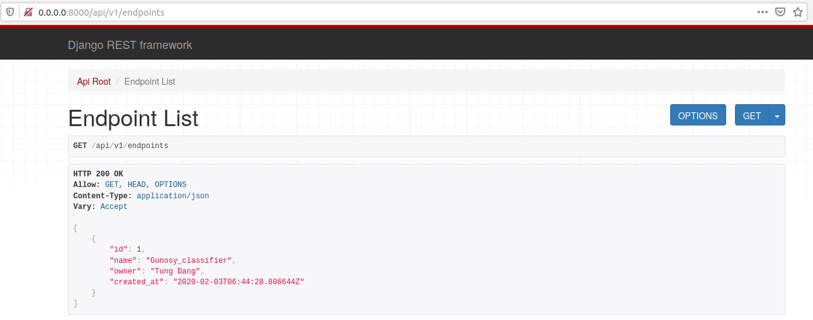
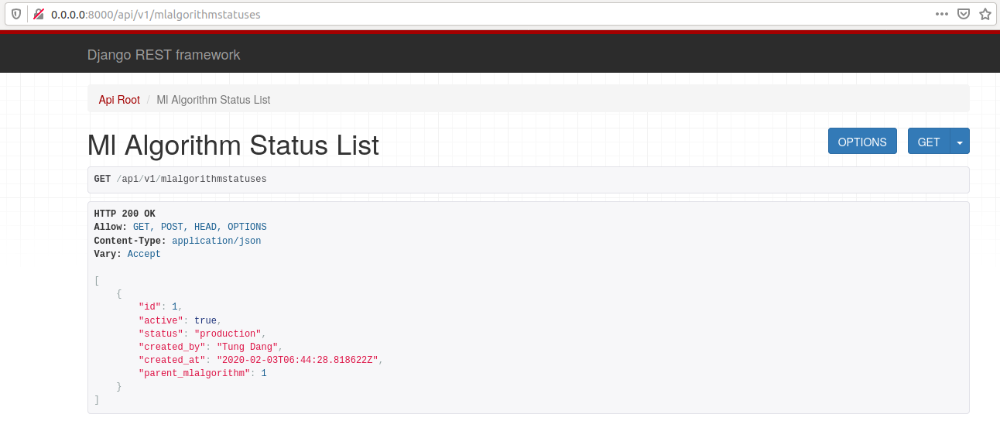

[](https://travis-ci.com/tungtokyo1108/Gunosy-Data_Analysis)

# Gunosy data analysis project: News classification 

## Pre-requisites:

* `docker` and `docker-compose`: The [Docker](https://docs.docker.com/install/) and [Docker-compose](https://docs.docker.com/compose/install/) command-line interface. Follow these installation instructions for your system.
* The minimum recommended resources for this model is 16 GB Memory + 8 CPUs (Ubuntu). 

## Run Locally

1. [Build the Model](#1-build-the-model)
2. [Deploy the Model](#2-deploy-the-model)
3. [Use the Model](#3-use-the-model)
4. [Cleanup](#4-cleanup)

### 1. Build the Model

Clone this repository locally. In a terminal, run the following command:

```
$ git clone https://github.com/tungtokyo1108/Gunosy-Data_Analysis.git
```

Change directory into the repository base folder:

```
$ cd Gunosy-Data_Analysis
```

To build locally, run:

```
$ sudo docker-compose build
```

All required model assets will be downloaded during the build process. 

### 2. Deploy the Model

To run:

```
$ sudo docker-compose up
```

### 3. Use the Model

The API server automatically generates an page. Go to `http://0.0.0.0:8000/api/v1/` to load it. From there you can explore the API and also create test requests.





