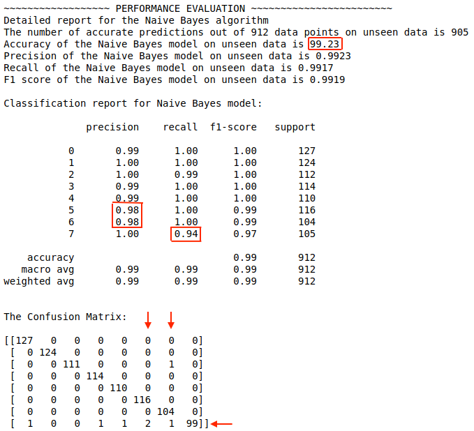
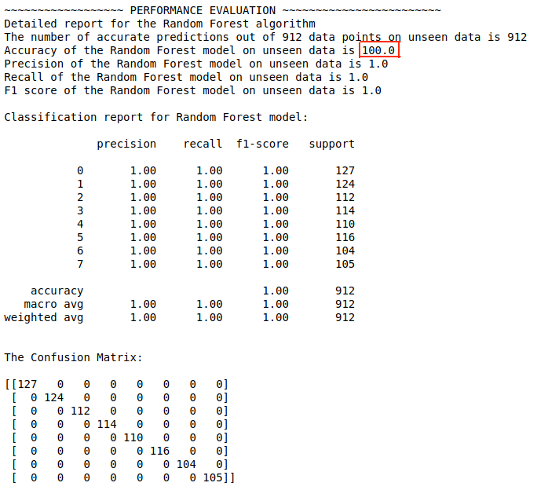

# Discription 

1. [Data collection](#1-data-collection)
2. [Data pre-precessing](#2-data-pre-processing)
3. [Feature engineering](#3-feature-engineering)
4. [Model training](#4-model-traing)
5. [Model evaluation](#5-model-evaluation)

## 1. Data collection 

[Gunosy_new.py](https://github.com/tungtokyo1108/Gunosy-Data_Analysis/blob/master/research/Gunosy_new.py) and [Gunosy_new notebook](https://github.com/tungtokyo1108/Gunosy-Data_Analysis/blob/master/research/Gunosy_new.ipynb) provides the method to collect data from `https://gunosy.com/`. The data in Gunosy web includes the 8 groups 「エンタメ」、「スポーツ」、「おもしろ」、「国内」、「海外」、「コラム」、「IT・科学」、「グルメ」and each of groups has some sub-groups. However the number of sub-groups among groups are not similar, 「スポーツ」 has the largest number with 1100 news but 「海外」 has only 400 news. Therefore, in order to avoid the imbalanced classification problems and limitation of my computer, the 400 news are sampled randomly for each of 8 groups. The "requests" and "bs4" packages are used to collect the data.  

Please note that the data training to run model in Web app is smaller significantly than data training to improve the accuracy of model in reseach section. Because for one time collection, 「海外」 group has only 200 news, so the only 200 news are sampled randomly for each of 8 groups.

## 2. Data pre-processing 

[Data pre-processing notebook](https://github.com/tungtokyo1108/Gunosy-Data_Analysis/blob/master/research/Gunosy_EDA.ipynb) 

## 3. Feature engineering 

For [feature engineering](https://github.com/tungtokyo1108/Gunosy-Data_Analysis/blob/master/research/Gunosy_classifier.ipynb), I use MeCab package for morphological analysis. MeCab lists the part of speech of the word and its pronunciation. So MeCab can analyze and segment a sentence into its parts of speech. 

In next step, I use TF-IDF (term frequency-inverse document frequency) in order to measure that the number of times a word appears in a Gusosy news and the inverse document frequency of the word across a set of news. 

## 4. Model training 

### Naive Bayes 

According to Gunosy's first requirement for [Naive Bayes classifier](https://github.com/tungtokyo1108/Gunosy-Data_Analysis/blob/master/research/Gunosy_classifier.ipynb), I used MultinominalNB in scikit-learn packge. One of the most important factors is to select the additive smoothing parameter - alpha parameter. To overcome the problem, I use the GridSearchCV in scikit-learn in order to find the optimal value for the alpha parameter. 

### Random Forest 

For Gunosy's second requirement for the improvement of document classification performance, I try to use the Randon Forest algorithm. To apply [Random Forest](https://github.com/tungtokyo1108/Gunosy-Data_Analysis/blob/master/research/Gunosy_classifier_RF.ipynb), the selections of values for n_estimators, max_depth, min_samples_leaf, min_samples_split, max_features are important. I use the RandomizedSearchCV method in order to find the optimal values for these parameters. 

## 5. Model evaluation

### Naive Bayes

I use the common measurements (accuracy, precision, recall, confusion matrix) to evaluate the model. 
- [Naive Bayes classifier](https://github.com/tungtokyo1108/Gunosy-Data_Analysis/blob/master/research/Gunosy_classifier.ipynb) achieves the high accuray `99.23%`
- There are the lower precisions for group 5 (国内) and group 6 (IT・科学). In both of cases, model makes the wrong predictions two news into group, but the true results are the different groups. 
- The recall of group 7 (コラム) is lowest (0.94). The model miss to predict 6 news into group 7. 

### Random Forest

To improve the accuracy, I try to apply the Random Forest
- [Random Forest](https://github.com/tungtokyo1108/Gunosy-Data_Analysis/blob/master/research/Gunosy_classifier_RF.ipynb) achieves the perfect accuracy `100%`